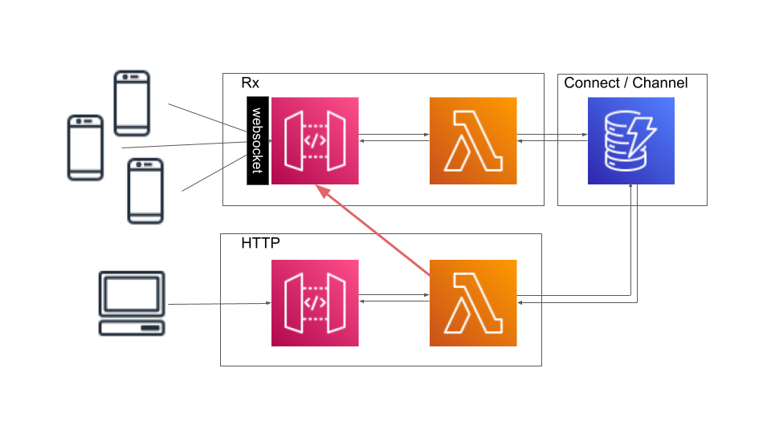

# lambda-go-websocket

Deploy websockets in AWS API Gateway with Go/Lambda. Store channel data
in a DynamoDB table and deploy with Terraform.

## Overview

The schema below show the architecture of the project:



It contains the following key components:

- a dynamodb database store the currently connected websockets as well as the
  associated channels. For now there is only one test channel
- the `Rx` section on the top is made of a lambda and an API gateway that
  are maintaining websocket connections with users. The lamba tracks
  connections in dynamodb
- the `HTTP` section on the bottom is mane of a lambda and an API gateway that
  can be used to discover connections to a channel and dispatch a message to
  all the users.

## Before you start

There are a few issues, you need to be aware of:

- [x] all the name, including the api gateway, lambda and the dynamodb table
  are more than less hardcoded. It might be a good idea to rename them 
- [x] the build is manual and must be performed before the deploy. A a result
  run `make` to start the deploy
- [x] you might want to change the region and your profile to connect to the
  right region/account
- [x] you should change the URL, Certificates, CORS to make the example fully
  operational

## Deploy

Deploying the project should be pretty simple. Assuming you have Git, Go,
Terraform and Make install, clone the project and run:
 
```bash
make
```

It should build the 2 lambda for Linux/x86_64. To deploy them and create
all the resources, run:

```bash
terraform init
terraform apply
```

## Test

There are several ways to test this code; an easy one is to rely on `wscat`

```bash
npm install -g wscat
```

The `wscat` command to run should as a terraform output. It would look like
below:

```bash
wscat --connect wss://xxxxxxxx.execute-api.us-east-1.amazonaws.com/staging
```

The Websocket will echo your message. Once you've established the websocket,
posting into the HTTP route would send a message to the websocket too:

```bash
curl https://yyyyyyyy.execute-api.us-east-1.amazonaws.com/staging/ \
  -XPOST -d'message' 
```

## To continue

Do not hesitate to open an issue or add a PR to the repository. You can
freely reuse this project, thank to the [MIT LICENCE](./LICENSE).
